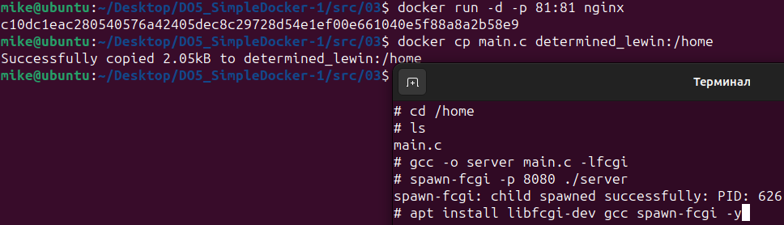
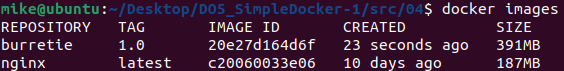

# Simple Docker Project

## Part 1. Готовый докер

- Устанавливаем `Docker`
- Скачаем официальный docker-образ с nginx при помощи `docker pull`

   

- Проверяем наличие образа при помощи `docker images`

   

- Запускаем docker образ при помощи `docker run -d [image_id|repository]`

   

- Проверяем, что образ запустился через `docker ps`

   

- Смотрим информацию о контейнере через `docker inspect [container_id|container_name]`

   

- Выводим размер контейнера, список замапленных портов и ip контейнера при помощи `docker inspect [container_id|container_name]` и `grep`

   

- Останавливаем докер образ через `docker stop [container_id|container_name]`

   
   
- Проверяем, что образ остановился через `docker ps`
   
   

- Запускаем докер с портами `80`и `443` в контейнере, замапленными на такие же порты на локальной машине, через команду run с помощью `docker run -d -p host_port:container_port [image_id|repository]`

   

- Проверяем, что в браузере по адресу `localhost:80` доступна стартовая страница `nginx`

   

- Перезапускаем докер контейнер через `docker restart [container_id|container_name]` и проверяем, запустился ли контейнер с помощью `docker ps`
   
   

## Part 2. Операции с контейнером

- Прочитаем конфигурационный файл nginx.conf внутри докер контейнера через команду `exec`

  

- Создаем на локальной машине файл `nginx.conf` и настраиваем в нем по пути `/status` отдачу страницы статуса сервера `nginx`

  

- Скопируем созданный файл `nginx.conf` внутрь докер образа через команду `docker cp` и перезапускаем `nginx` внутри докер образа через команду `exec`

  

- Проверяем, что по адресу `localhost:80/status` отдается страничка со статусом сервера `nginx`

  
- Экспортируем контейнер в файл container.tar через команду export
  

- Останавливаем контейнер, удаляем образ через `docker rmi [image_id|repository]`, не удаляя перед этим контейнеры, а потом удаляем остановленный контейнер

  

- Импортируем контейнер обратно через команду `import`

  ![docker import -c (Инструкция к dockerfile) 'cmd ["nginx", "-g", "daemon off;"]' -c (Инструкция к dockerfile) 'ENTRYPOINT ["/docker-entrypoint.sh"]' container.tar (filename) nginx (image name)](02/pics/07import.png)

- Запускаем импортированный контейнер

   

- Проверяем, что по адресу `localhost:80/status` отдается страничка со статусом сервера nginx

   

## Part 3. Мини веб-сервер

- Напишем мини сервер на `C` и `FastCgi`, который будет возвращать простейшую страничку с надписью `Hello World!`

   

- Запускаем написанный мини сервер через `spawn-fcgi` на порту `8080` на `nginx`

   

- Напишем свой `nginx.conf`, который будет проксировать все запросы с `81` порта на `127.0.0.1:8080`

   

- Перезапускаем `nginx` после переноса в контейнер нового конфига

   

- Проверяем в браузере по `localhost:81`, отдается ли написанная нами страничка

   

- Сохраним файл `nginx.conf` (он понадобится нам позже)

## Part 4. Свой докер

- Написать свой докер образ, который собирает исходники мини сервера на `FastCgi` из [Части 3](#part-3-мини-веб-сервер), запускает его на `8080` порту, копирует внутрь образа написанный `nginx.conf` и запускает `nginx`

   
   

- Собираем написанный докер образ через `docker build` при этом указав `имя` и `тег`

   

- Проверяем через `docker images`, что все собралось корректно

   

- Запускаем собранный докер образ с маппингом `81` порта на `80` на локальной машине и маппингом папки `nginx` внутрь контейнера по адресу, где лежат конфигурационные файлы `nginx'а`

   

- Проверяем `localhost:80`, доступна ли страничка написанного мини сервера
   
   

- Дописываем в `nginx/nginx.conf` проксирование странички `/status`, по которой надо отдавать статус сервера `nginx`

   

- Перезапускаем докер образ

   

- Проверяем `localhost:80/status`, отдается ли страничка со статусом `nginx`

   

## Part 5. Dockle

- Просканируем образ из предыдущего задания через `dockle [image_id|repository]`

   

- Исправляем образ так, чтобы при проверке через dockle не было ошибок и предупреждений

   

## Part 6. Базовый Docker Compose

- Установим `docker-compose`
- Напишем файл `docker-compose.yml`, с помощью которого поднимаем докер контейнер из [Части 5](#part-5-dockle) и замапим `8080` порт второго контейнера на `80` порт локальной машины

   

- Поднимаем докер контейнер с `nginx`, который будет проксировать все запросы с `8080` порта на `81` порт первого контейнера

   

- Остановим все запущенные контейнеры. Соберём и запустим проект с помощью команд `docker-compose build` и `docker-compose up`

   

- Проверяем `localhost:80`, отдается ли написанная нами страничка, как и ранее

   
